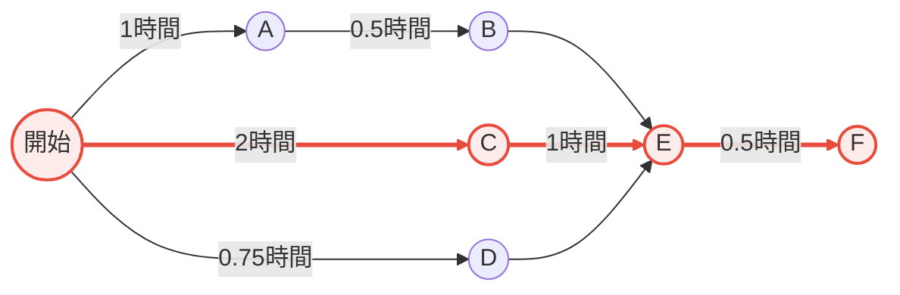

# 手巻き出前セット提供プロジェクト計画書

## プロジェクト概要

### 背景と目的
- **期限**: 10/31までに計画書を完成
- **目的**: 11/1に出前寿司を提供するプロジェクトを開始
- **成果物**: 色々な場面を想定した手巻き出前セットを提供するための計画（調達、調理）
- **スコープ**: 計画書のみ

## 材料選定結果

コスト最適化分析により、以下の材料セットを選定しました：

| 材料 | カテゴリ | 値段 | 販売個数 | 加工時間 | 人気度 |
|------|----------|------|----------|----------|--------|
| 米（シャリ） | 穀物 | 600円 | 70個 | 1時間 | 3 |
| ぶり | 魚介類 | 2,300円 | 30個 | 1時間 | 5 |
| ほっき貝 | 魚介類 | 2,800円 | 40個 | 1時間 | 4 |
| きゅうり | 野菜 | 150円 | 50個 | 0.25時間 | 3 |
| 卵 | 畜産物 | 200円 | 10個 | 0.5時間 | 4 |

**合計コスト**: 6,050円
**総販売個数**: 200個
**平均人気度**: 3.8

## タスク一覧

| タスク名 | タスク内容 | 先行タスク | 所要時間 |
|---------|-----------|-----------|---------|
| A | 米炊き | なし | 1時間 |
| B | 料理酢混ぜ合わせ | Aが完了してから実行 | 0.5時間 |
| C | 魚を捌く | なし | 2時間 |
| D | 野菜、卵の加工 | なし | 0.75時間 |
| E | 材料合わせ、パック詰め | B、C、Dが終わってから実行 | 1時間 |
| F | 個包装調味料添付 | Eが終わってから実行 | 0.5時間 |

## PERT図

## クリティカルパス分析

**クリティカルパス**: 開始 → C（魚を捌く） → E（材料合わせ、パック詰め） → F（個包装調味料添付）

**総所要時間**: 3.5時間

クリティカルパス上のタスク（赤線で表示）：
1. C: 魚を捌く（2時間）
2. E: 材料合わせ、パック詰め（1時間）
3. F: 個包装調味料添付（0.5時間）

## プロジェクトスケジュール

プロジェクトの全体完了には最短で**3.5時間**が必要です。

並行作業可能なタスク：
- タスクA（米炊き）とタスクC（魚を捌く）は並行実行可能
- タスクD（野菜、卵の加工）も並行実行可能

## リスクと対策

1. **クリティカルパス上の遅延リスク**
   - タスクC（魚を捌く）が最も時間を要するため、遅延するとプロジェクト全体に影響
   - 対策: 熟練者を配置、事前準備を徹底

2. **材料調達リスク**
   - ぶり、ほっき貝の鮮度管理が重要
   - 対策: 信頼できる仕入れ先の確保、当日配送の手配

3. **品質管理リスク**
   - 人気度の高い材料（ぶり: 5、ほっき貝: 4）の品質が顧客満足度に直結
   - 対策: 品質チェック工程の明確化

## まとめ

本計画により、コスト効率と人気度のバランスが取れた手巻き出前セットの提供が可能です。総所要時間3.5時間で200個分の材料を準備でき、総コスト6,050円で高品質な商品を提供できます。
