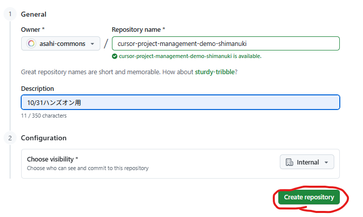
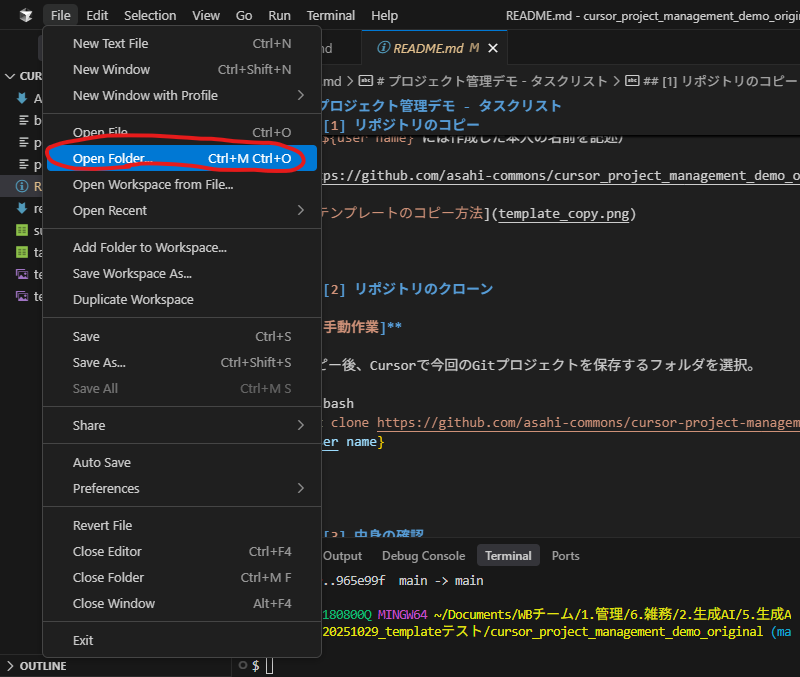
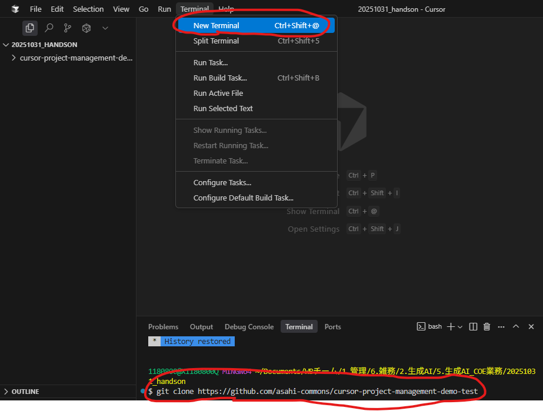
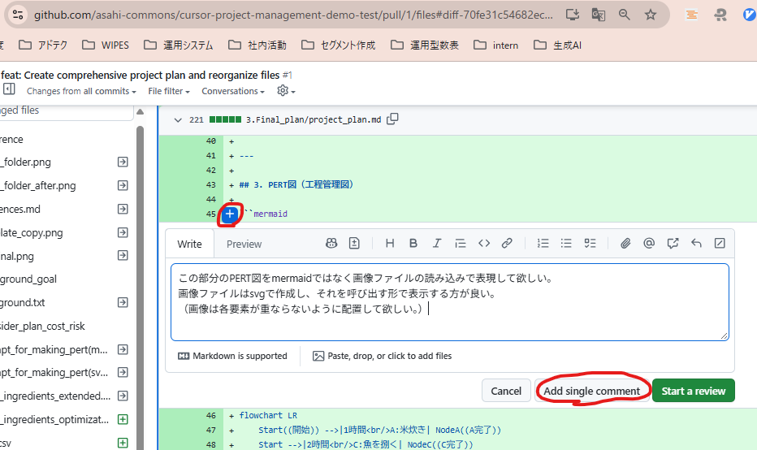

# プロジェクト管理デモ - タスクリスト

---

## 第一部：プロジェクトセットアップ（[1]～[6]）

---

## [1] リポジトリのコピー

**[手動作業]**

下記テンプレートリポジトリで「Use this template」を押下。  
その後、会社用の個人アカウントをオーナーにしてリポジトリをコピー。

コピー時のリポジトリ名は、「`cursor-project-management-demo-${user name}`」とすること。  
（`${user name}`には作成した本人の名前を記述）

https://github.com/asahi-commons/cursor_project_management_demo_original.git



---

## [2] 作業フォルダ選択

**[手動作業]**

コピー後、Cursorで今回のGitプロジェクトを保存するフォルダを選択。



---

## [3] リポジトリのクローン

**[手動作業]**

添付画像のように操作してターミナルを開いてください。  
ターミナルを開いたら、下記コマンドを入力してください。

（`${user name}`には作成した本人の名前を記述）

```bash
git clone https://github.com/asahi-commons/cursor-project-management-demo-${user name}
```



---

## [4] 中身の確認

**[手動作業]**

中身を確認

---

## [5] 作業ブランチの作成

**[手動作業]**

Cursorで今回のGitプロジェクトを再度選び直します。  
（cdによる移動だとpathの処理で問題が起き、処理遅延が発生する恐れがあります）

その後、[3]で行ったようにターミナルを開いて下記を入力し、手動で作業ブランチを作成してください。  

```bash
git checkout -b feat/project-plannning
```

---

## [6] ファイル整理

**[Agentへの指示]**

ファイルの中身を確認して、AGENTS.mdの内容に沿って整理をして欲しい。

---

## 第二部：データ分析とプロジェクト計画書作成（[7]～[11]）

---

## [7] 寿司材料のコスト最適化分析

**[手動作業]**

[6]の作業後、別のChatを開いて下記の指示を行ってください。

**[Agentへの指示]**

`@sushi_ingredients_extended.csv` のファイルを確認。

そのデータを参考に、米は必ず選び、魚介類は最低2品目、他2品目を選んで、最も費用が安く、人気度が高いセットを教えて欲しい。

また、その時にかかるそれぞれの加工時間、販売個数も教えて欲しい。

---

## [8] 分析結果の保存

**[Agentへの指示]**

新たなファイルを作成して、上記の結果を保存し、ファイル整理規則に従ってこのディレクトリ配下に保存して欲しい。

---

## [9] タスクCSVへの所要時間追記

**[Agentへの指示]**

上記で作成したファイルを参考に選定された組み合わせから、csvのフォーマットに従ってtask.csvの該当箇所に所用時間を追記して欲しい。

---

## [10] プロジェクト計画書の生成

**[Agentへの指示]**

プロジェクトマネージャーとして行動してください。

まず、`prompt_for_making_pert(mermaid).txt`の指示を見て`task.csv`の内容からMarkdownファイルを生成して欲しい。

また、上記のファイルに`background.txt`の内容も組み合わせて、計画の説明についても追記して欲しい。

最後に、生成したら、生成したMarkdownファイルの中身が空になっていないか確認して、空だったらやり直して欲しい。

---

## [11] プルリクエストの作成

**[Agentへの指示]**

作業ブランチをリポジトリにpushして、プルリクエストを作成して欲しい。

プルリクエスト作成後、文字化けが発生していないか確認し、文字化けが発生していたら英語で記述し直して欲しい。

---

## 第三部：レビュー対応（[12]～[14]）

---

## [12] レビューコメントの追加

**[手動作業]**

レビューする該当箇所を選択して、下記を記述。

記述後、「Add single comment」を押してコメントを追加。

```
この部分のPERT図をmermaidではなく画像ファイルの読み込みで表現して欲しい。
画像ファイルはsvgで作成し、それを呼び出す形で表示する方が良い。
（画像は各要素が重ならないように配置して欲しい。）
```



---

## [13] Pull Requestの確認

**[手動作業]**

[12]の作業後、別のChatを開いて下記の指示を行ってください。

**[Agentへの指示]**

ghコマンドを使って、現在のディレクトリに関連づいているGitHubリポジトリで現在開かれているpull requestを教えて欲しい。

また、下記コマンドを使って、上記のpull requestでコメントされている全内容を確認して、あれば内容を教えて欲しい。

（`${repository name}`、`${pull request number}`は適宜変更）

### コマンド

```bash
gh api repos/asahi-commons/${repository name}/pulls/${pull request number}/comments
```

---

## [14] レビュー対応の自動化

**[Agentへの指示]**

上記のレビューコメントの内容を確認し、下記を実行して欲しい。

ただ、powershellだと文字化けするので、使う場合は文字化けしないように対策して欲しい。  
（issueの中身を別ファイルで用意してから投稿するなど）

もし、何度か試して失敗するようだったら、英語で記述して欲しい。

1. コメント内のレビュー内容に応じたIssueの自動作成（作成後、文字化けしていないか確認）
2. ファイルの自動修正
3. 修正のコミット
4. Issueの完了・クローズ
5. PR完了コメントの投稿（投稿後、文字化けしていないか確認）
